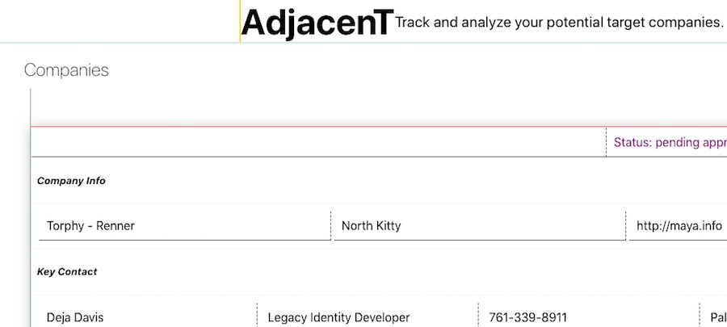

# Adjacent App

## Business Problem

A company is looking to achieve inorganic growth through acquisitions. They have asked us to develop an online tool to track and analyze potential target companies.

## Challenge

Develop a prototype that will allow the client to perform the following activities:

- [x] View a list of targets
- [x] Edit an existing target
- [x] Create a new target
- [x] Delete a target

Assumptions:

- Use a modern JavaScript framework
  - [x] React
- Data does not need to be persisted
  - [x] Use mock data
- Examples of data to be captured:

  - [x] Status (e.g., researching, pending approval, approved, declined)
  - [x] CompanyInfo
  - [x] KeyContacts
  - [x] FinancialPerformance

## Solution



## Installation

This project was bootstrapped with [Create React App](https://github.com/facebook/create-react-app). Use yarn or npm to install. In the project directory, you can run:

### `yarn start`

Runs the app in the development mode.
Open [http://localhost:3000](http://localhost:3000) to view it in the browser.

### `yarn test`

Launches the test runner in the interactive watch mode.

### `yarn run build`

Builds the app for production to the `build` folder.

## Usage

Create, read, update, and delete items in a list of fake companies. The app uses React Hooks to manage state.

For example, create a target:

```javascript
// App.js

const createTarget = company => {
  setCreating(true)
  company.companyId = faker.random.uuid()

  setCompanies([...companies, company])
}

return (
  {creating && (
    <CreateTargetForm
      createTarget={createTarget}
      creating={creating}
      setCreating={setCreating}
    />
  )}
)
```

Then add it to a list of companies:

```javascript
// CreateTargetForm.js

const initialFormState = {
  companyId: null,
  companyName: '',
  ...
}

const [company, setCompany] = useState(initialFormState)

const handleInputChange = event => {
  const { name, value } = event.target

  setCompany({ ...company, [name]: value })
}

const handleSubmitForm = event => {
  event.preventDefault()
  if (!company.companyName) return

  createTarget(company)
  setCompany(initialFormState)
  setCreating(false)
}
```

## Built With

- [Create React App](https://facebook.github.io/create-react-app/)
- [React Hooks](https://reactjs.org/docs/hooks-intro.html)
- [styled-components](https://www.styled-components.com/)
- [Rebass](https://rebassjs.org/)
- [Faker.js](https://github.com/marak/Faker.js/)

## To Do

- [ ] Test, test
- [ ] Add more Hooks: effect, reducer
- [ ] Form validation
- [ ] Design responsively
- [ ] Refactor components: logic from view, input from form
- [ ] Static typechecking: try Typescript
- [ ] Visual panache: icons, graphs, thumbnails

### Author

parker smathers / [parkersmathers.github.io](https://parkersmathers.github.io/)

### License

This project is [MIT licenced](https://github.com/parkersmathers/adjacent-app/blob/master/LICENSE).
